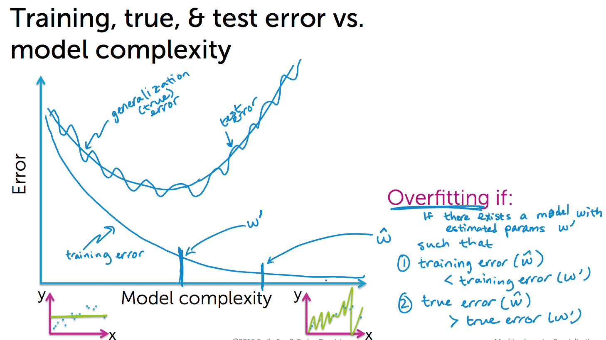

<!-- -------------------------- -->
#            Module 2             #
<!-- -------------------------- -->
**Multiple regression**

Linear regression with multiple features. Most important machine learning algorithm.

- Polynomial regression:
  - Quadratic function:
    f(x) = w0 + w1.x + w2.x^2
  - Higher order polynomial function
    f(x) = w0 + w1.x + w2.x^2 + ... + wn.x^n
  + Generic polynomial regression model:
    yi = w0 + w1.xi + w2.xi^2 + ... + wn.xi^n + ei

    Here we see power of x. These are considered as different features. And we associate these features with parameters.
    - Feature 1: 1 (constant)       - parameter 1: w0
    - Feature 2: x                  - parameter 2: w1
    - Feature 3: x^2                - parameter 3: w2
    - ...                           - ...
    - Feature n+1: x^n              - parameter n+1: wn

<!-- -------------------------- -->
#            Module 3             #
<!-- -------------------------- -->
**3 Measures of errors:**
  - Training error
  - True error (generalization error)
  - Testing error

**Assessing Performance**
- Overfitting:
  When there exists a model with estimated parameter w-prime such that the following two conditions hold:
  - Training error of w-hat is less than the training error of w-prime.
  - But on the other hand, the test error of w-hat is greater than the test error of w-prime.

  

**How to divide training and test data?**
(65-35)
Keep enough data points in your test data to form a reasonable estimate to generalization error,
and put all other data points to train your model.

**3 sources of error + Bias variance tradeoff**
- Noise: Non-deterministic reasons behind the error of observation. Not reducible term.
- Bias: The difference between the average fit (considering fits from different dataset) and the 'true function'.
- Variance: How much a fit can vary for different dataset? If the vary dramatically then your prediction would very particular to that dataset and not flexible for other dataset. That would cause error in your prediction.

+ Bias-variance tradeoff:

**Summary**
- The workflow:
  1. Model selection: Often, need to choose tuning parameters (lambda) controlling model complexity (eg. degree of polynomial).
  2. Model assessment: Having selected a model, assess the generalization error.

1. Model selection:
   - Divide the dataset into 3 parts (80%-10%-10% | 50%-30%-20%):
     1. Training set: Fit several models with different complexity (simple to complex) (eg. straight-line-model, polynomial-model, 13-degree-polynomial model, ...)
     2. Validation set: Used to select optimal complex model. Use the model that gives minimum error against validation set (true error). It helps us to not select overfitted model from training set.
     3. Test set: Test the actual performance of the model.

<!-- -------------------------- -->
#            Module 4             #
<!-- -------------------------- -->
**How to spot overfitting in polynomial regression**
- Ridge regression: a way to automatically balance between bias and variance.
  When models become overfit, the estimated coefficients of those models tend to become really large in magnitude.

- Cross validation: Choosing the tuning parameter lambda ()
  Keep aside your test dataset, then use the remaining dataset for training and validation.
  - Leave one out cross validation (k = 1)
  - 5 fold cross validation (k = 5)
  - 10 fold cross validation (k = 10)

<!-- -------------------------- -->
#            Module 5             #
<!-- -------------------------- -->
**Feature selection**
- explicitly search over all possible models
- implicitly do a feature selection using regularized regression

**Feature selection procedure:**
- All subsets: Search over every possible combination of features we might want to include in our model and look at the performance of each of those models.
    - For 0 feature:
    - For 1 feature:
    - For 2 features:
    - ... ... ...
      At the end of every step we can say, out of all models with N feature(s), which one fit the training data the best?
- Greedy algorithms:

